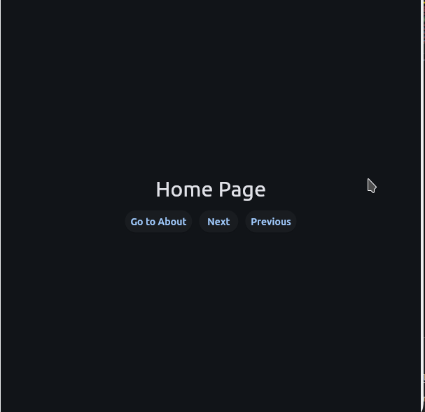

# Flet Stacked

`Stacked` is a custom Flet control for managing multiple pages with smooth animations. It supports switching pages by key or index, next/previous navigation, and customizable transitions, making it perfect for dynamic UIs.

## Features

- Smooth Transitions: Seamlessly switch between pages with customizable animations and durations.

- Flexible Navigation: Navigate by keys, indices, or with next/previous controls for dynamic UIs.

- State Management: Easily access the current page or route for efficient state handling.


## Installation
You can install Flet Stacked using pip:

```bash
pip install git+https://github.com/omamkaz/flet-stacked.git
```

## Usage

```python
import flet as ft
from flet_stacked import Stacked


def main(page: ft.Page):
    page.title = "Flet Stacked Example 1"
    page.vertical_alignment = ft.MainAxisAlignment.CENTER
    page.horizontal_alignment = ft.CrossAxisAlignment.CENTER

    page.window.width = page.window.height = 600

    pages = {
        "home": ft.Text("Home Page", size=30),
        "about": ft.Text("About Page", size=30),
        "contact": ft.Text("Contact Page", size=30),
    }

    stacked = Stacked(pages, index="home")

    def go_to_about(e):
        stacked.switch("about")

    def next_page(e):
        stacked.go_next()

    def prev_page(e):
        stacked.go_prev()

    page.add(
        stacked,
        ft.Row(
            [
                ft.ElevatedButton("Go to About", on_click=go_to_about),
                ft.ElevatedButton("Next", on_click=next_page),
                ft.ElevatedButton("Previous", on_click=prev_page),
            ]
        ),
    )


if __name__ == "__main__":
    ft.app(target=main)
```

## Output of above code


